# 实验一  ——  图像的频域变换

# 实验目的

1. 初步掌握 MATLAB 语言处理图像文件的方法。
2. 运用 MATLAB 实现图像的频域变换。

# 实验内容

使用 MATLAB，完成以下的图像的读写、显示：

1. 图像读、写、文件格式转换
2. 二进制图像显示
3. 灰度图像显示
4. RGB 图像显示
5. 多帧图像显示
6. 显示多幅图像

使用MATLAB，完成以下变换：

1. 傅里叶变换
2. 离散余弦变换

# 实验过程及结果

实验过程、源码及执行结果截图如下。

## MATLAB 图像显示方法

### 1. 图像的读写

#### A) 图像读

```matlab
>> RGB = imread('ngc6543a.jpg');
>> figure,imshow(RGB);
>> 
```

#### B) 图像写

先从一个.mat 文件中载入一幅图像，然后利用图像写函数imwrite，创建一个.bmp文件，并将图像存入其中。

```matlab
>> load clown
>> whos
  Name           Size                 Bytes  Class     Attributes

  RGB          650x600x3            1170000  uint8               
  X            200x320               512000  double              
  caption        2x1                      4  char                
  map           81x3                   1944  double              

>> imwrite(X,map,'clown.bmp');
>> 
```

#### C) 图像文件格式转换

```matlab
>> bitmap = imread('clown.bmp','bmp');
>> imwrite(bitmap,'clown.png','png');
>> 
```

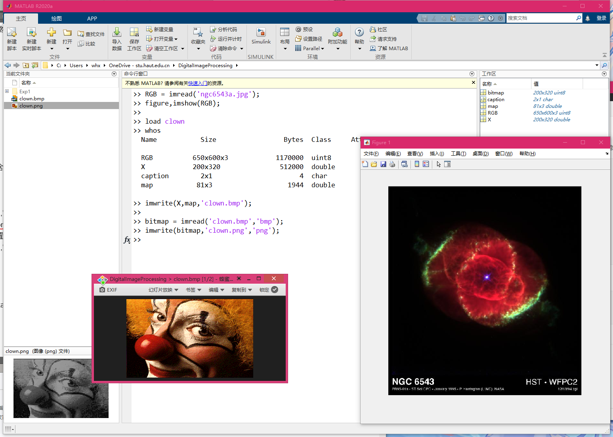

### 2. 图像显示

#### A) 二进制图像的显示

```matlab
>> BW1=zeros(20,20);		%创建仅包含0/1的双精度图像
>> BW1(2:2:18,2:2:18)=1;
>> imshow(BW1,'InitialMagnification','fit');   %double类型[0,1]
>> BW2=uint8(BW1);
>> figure,imshow(BW2,'InitialMagnification','fit');
>> figure,imshow(BW2,[],'InitialMagnification','fit');  %uint8类型[0,255]
>> BW3=BW2~=0; 			%逻辑标志置为on
>> figure,imshow(BW3,'InitialMagnification','fit');
>> 
```

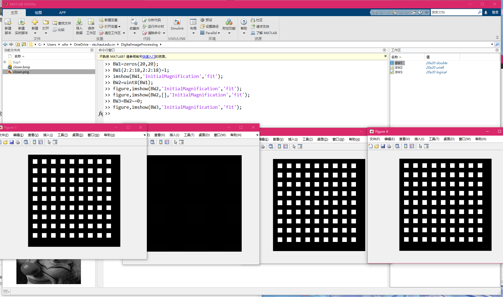

#### B) 灰度图像的显示

```matlab
>> I=imread('spine.tif');
>> J=filter2([1 2;-1 -2],I);
>> imshow(I,[]);
>> figure,imshow(J,[]);
>> 
```

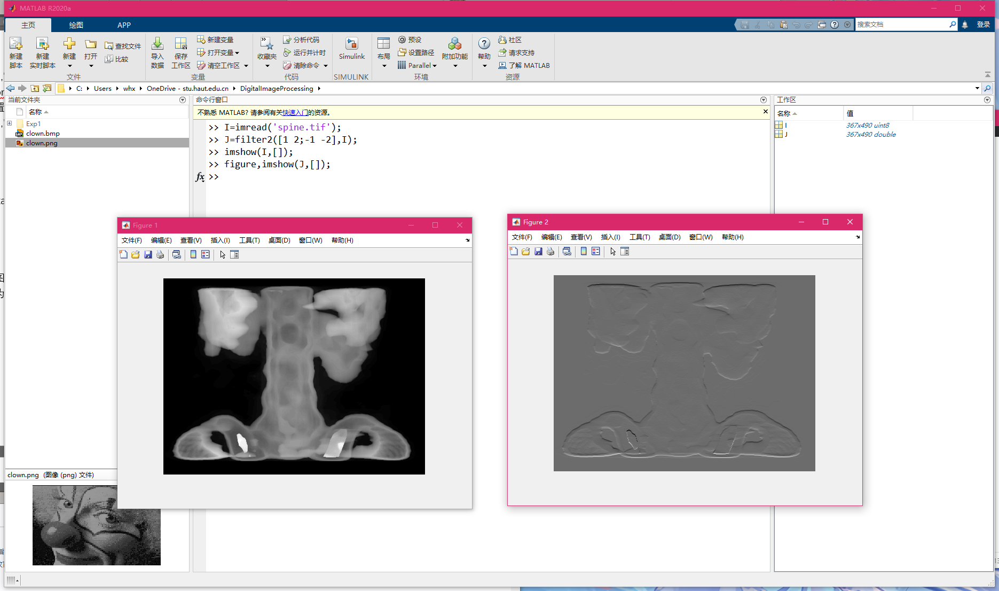

#### C) 灰度图像的显示

```matlab
>> load clown
>> imwrite(X,map,'clown.bmp');
>> imshow(X);
>> imshow(X,map);
>> 
```

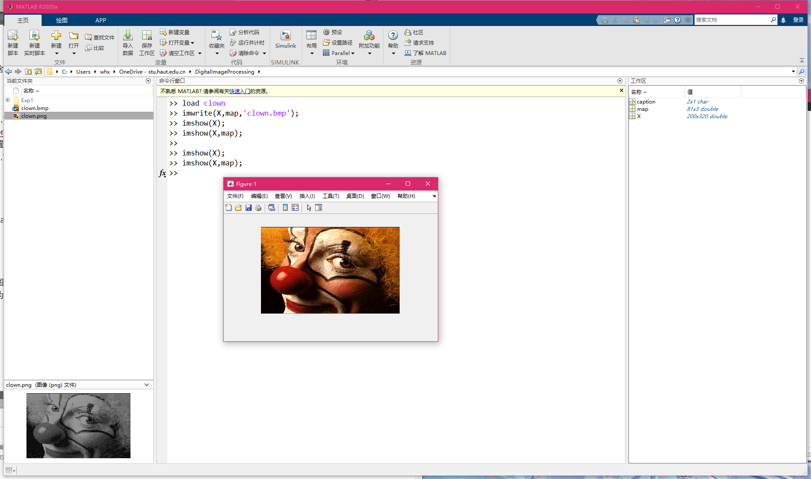

#### D) RGB图像的显示

```matlab
>> RGB=imread('ngc6543a.jpg');
>> figure,imshow(RGB);
>> imshow(RGB(:,:,3));
>> 
```

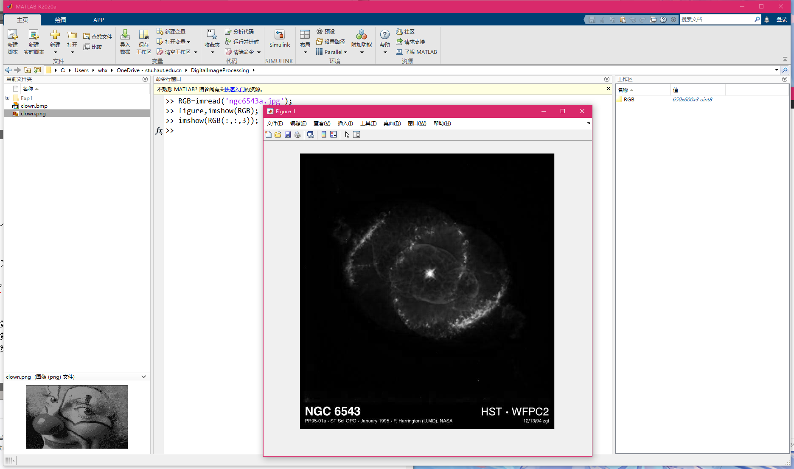

#### E) 多帧图像的显示

```matlab
>> RGB=imread('ngc6543a.jpg');
>> figure,imshow(RGB);
>> imshow(RGB(:,:,3));
>> 
```
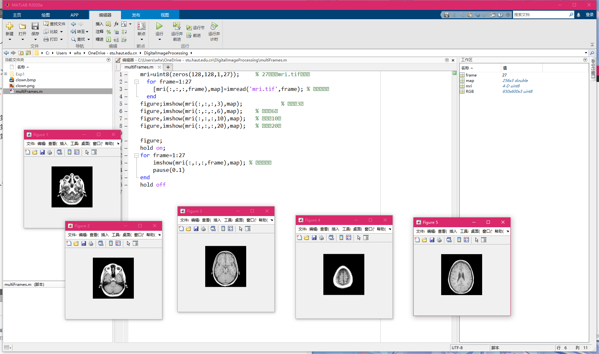

#### F) 显示多幅图像

```matlab
>> [X1,map1]=imread('forest.tif');
>> [X2,map2]=imread('trees.tif');
>> figure;
>> subplot(1,2,1),imshow(X1,map1);
>> subplot(1,2,2),imshow(X2,map2);
```

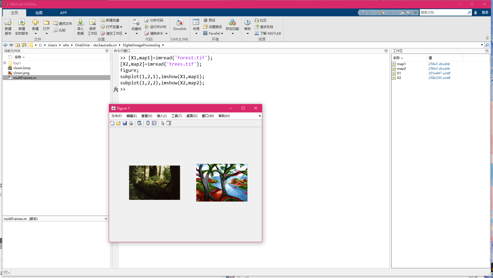

## 图像的频域变换

### 1. 傅里叶变换

#### A) 绘制一个二值图像矩阵，并将其傅立叶函数可视化

```matlab
f = zeros(30,30);
f(5:24,13:17) = 1;
figure,imshow(f,'InitialMagnification','fit');
F = fft2(f);
F2 = log(abs(F));
figure,imshow(F2,[-1 5],'InitialMagnification','fit');
F=fft2(f,256,256); %零填充为256×256矩阵
figure,imshow(log(abs(F)),[-1 5],'InitialMagnification','fit');
F2=fftshift(F);    %将图像频谱中心由矩阵原点移至矩阵中心
figure,imshow(log(abs(F2)),[-1 5],'InitialMagnification','fit');
```

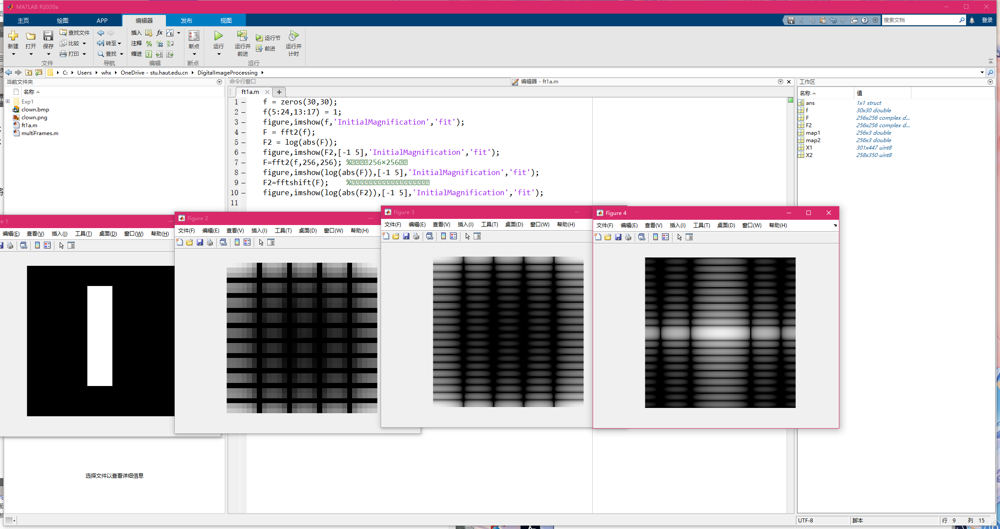

#### B) 利用傅里叶变换恢复图像

```matlab
I=imread('cameraman.tif');
figure,subplot(1,3,1),imshow(I);
F = fft2(I);
I2 = ifft2(F);
subplot(1,3,2),imshow(I2, []);
I3 = ifft2(F./abs(F));  % 幅度谱变为1
subplot(1,3,3),imshow(I3, []);
```

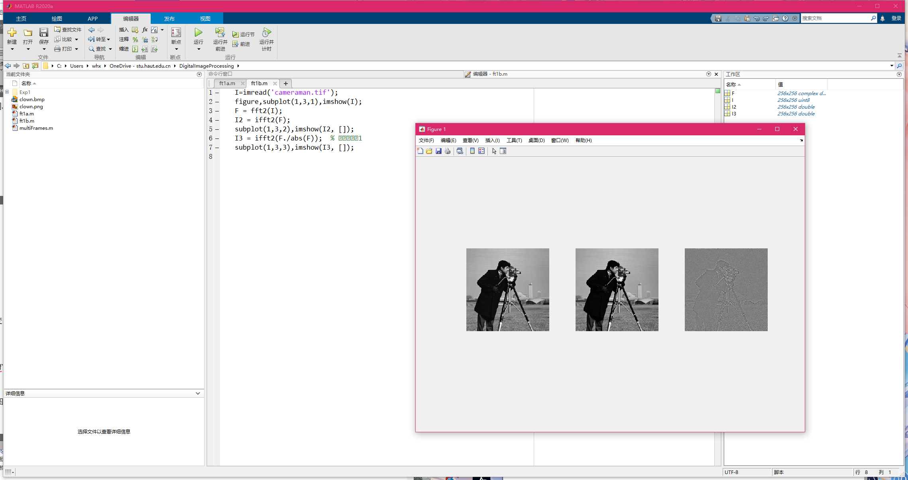

### 2. 离散余弦变换（DCT）

#### A) 使用 dct2 对图像 'autumn.tif' 进行 DCT 变换

```matlab
RGB=imread('autumn.tif');
figure;imshow(RGB);
I=rgb2gray(RGB); %转换为灰度图像
figure,imshow(I);
J=dct2(I);
figure,imshow(log(abs(J)),[]),colormap(jet(64));colorbar;
```

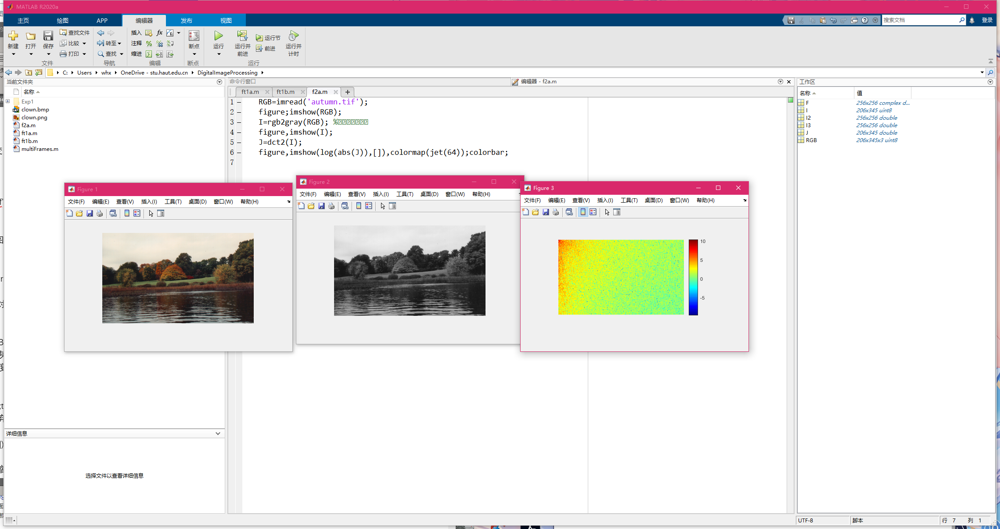

#### B) 将上述 DCT 变换结果中绝对值小于 10 的系数舍弃，使用 idct2 重构图像并与原图像比较

```matlab
RGB=imread('autumn.tif');
figure,subplot(2,2,1),imshow(RGB);title('原始彩色图像');
I=rgb2gray(RGB); 		%转换为灰度图像
subplot(2,2,2),imshow(I);title('灰度图像');
J=dct2(I);
K=idct2(J);
subplot(2,2,3),imshow(K,[0 255]);title('离散余弦反变换恢复图像');
J(abs(J)<20)=0; 			%舍弃系数
K2=idct2(J);
subplot(2,2,4),imshow(K2,[0 255]);title('舍弃系数后离散余弦反变换恢复图像');
```

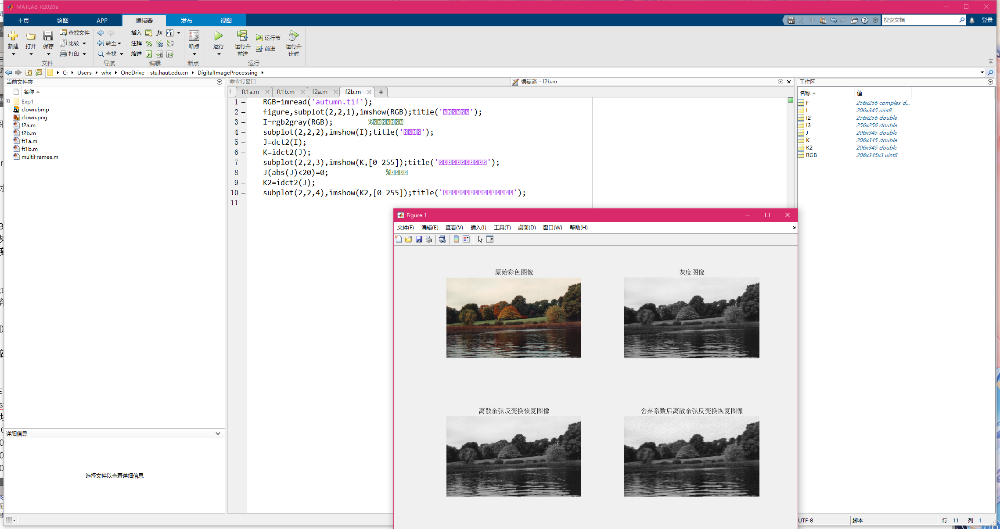

#### C) 利用 DCT 变换进行图像压缩

```matlab
I=imread('cameraman.tif');
I=im2double(I);
T=dctmtx(8);    %DCT变换矩阵
fun1 = @(block_struct) T*block_struct.data*T';
B=blockproc(I,[8,8],fun1);   %分块DCT变换
mask=[1  1  1  1  0  0  0  0
      1  1  1  0  0  0  0  0
      1  1  0  0  0  0  0  0
      1  0  0  0  0  0  0  0
      0  0  0  0  0  0  0  0
      0  0  0  0  0  0  0  0
      0  0  0  0  0  0  0  0
      0  0  0  0  0  0  0  0];
fun2 = @(block_struct) mask.*block_struct.data;
B2=blockproc(B,[8 8],fun2);    %每小块取低频系数
fun3 = @(block_struct) T'*block_struct.data*T;
I2=blockproc(B2,[8 8],fun3);
figure,subplot(1,2,1),imshow(I);title('原始图像');
subplot(1,2,2),imshow(I2);title('离散余弦变换压缩后恢复图像');
```

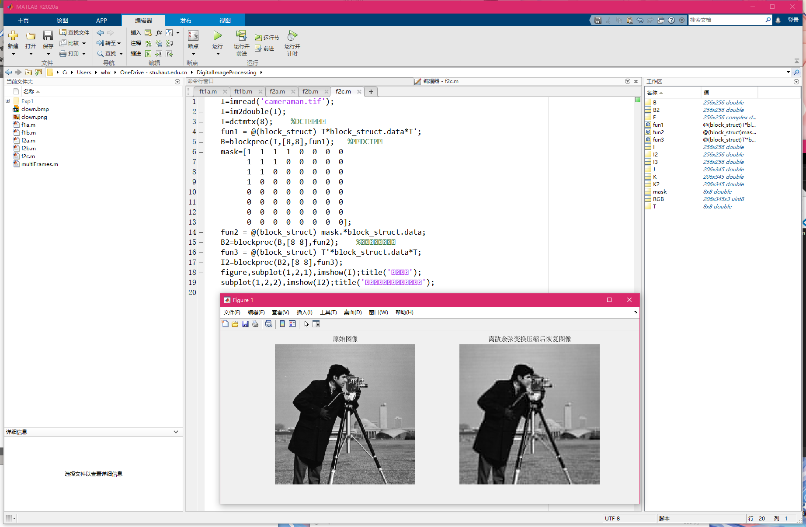