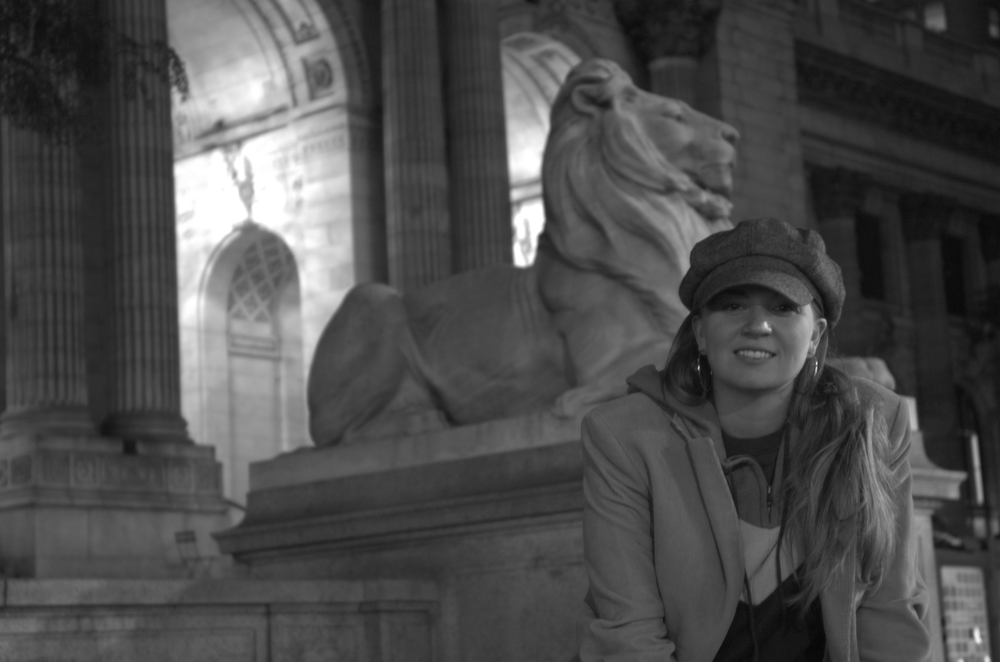
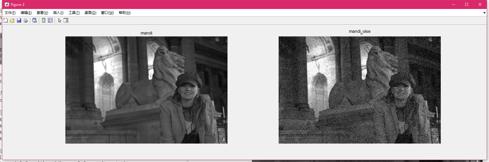
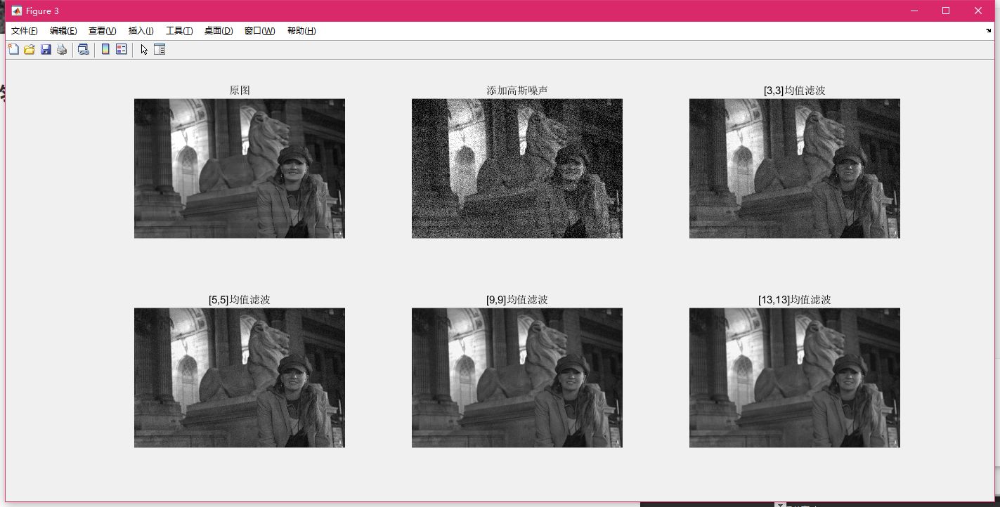
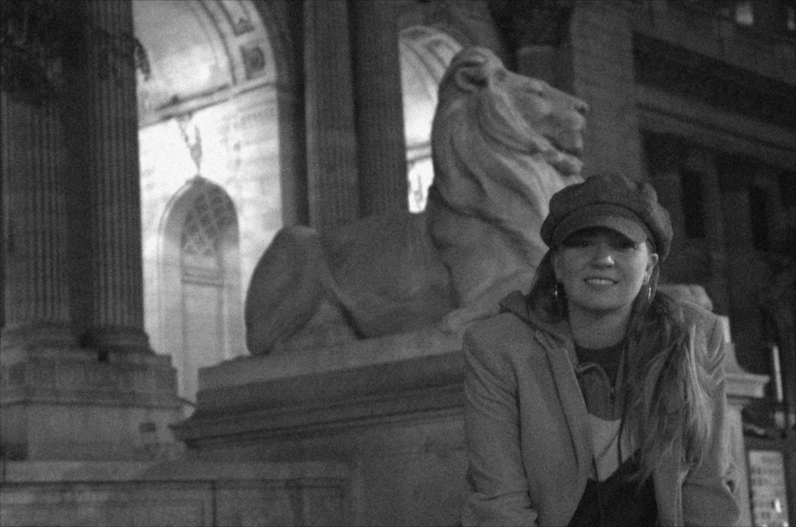

# 实验二——图像增强与平滑

# 一、实验目的

1. 掌握图像增强与平滑的基本原理
2. 能够使用 MATLAB 对图像进行简单的增强处理

# 二、实验内容

对图像添加高斯噪声，并利用不同大小的均值滤波平滑图像，观察不同大小的均值模板对含噪图像的影响，提交代码和图片。

# 三、实验过程及结果

## 1. 实验原始图像

这里选取了 MATLAB 自带的 mandi.tif 作为实验图像。



```matlab
% 读入图像
mandi = imread('mandi.tif');
```

## 2. 添加高斯噪声

```matlab
% 添加高斯噪声
mandi_noise = imnoise(mandi,'gaussian',0,0.01);
imwrite(mandi_noise, 'mandi_noise.png');  % 写入添加高斯噪声后的图像到文件

% 展示图像
f1 = figure;
figure(f1),
subplot(1,2,1),
imshow(mandi),title('mandi');
```


展示效果如下图。



## 3. 均值滤波

利用 `fspecial` 函数创建滤波算子，再使用 `filter2` 函数进行均值滤波。

```matlab
% 为使用filter2函数滤波，转换图像为double类型矩阵
mandi_noise = im2double(mandi_noise);

% 创建不同大小的均值滤波器
h_avg_std = fspecial('average');        % 默认大小为[3,3]
h_avg_5_5 = fspecial('average',[5,5]);
h_avg_9_9 = fspecial('average',[9,9]);
h_avg_13_13 = fspecial('average',[13,13]);

% 滤波
filtered_std = filter2(h_avg_std, mandi_noise);
filtered_5_5 = filter2(h_avg_5_5, mandi_noise);
filtered_9_9 = filter2(h_avg_9_9, mandi_noise);
filtered_13_13 = filter2(h_avg_13_13, mandi_noise);
```

## 4. 展示滤波图像

使用 `figure` 指定两个图窗，展示原图、添加高斯噪声后的图像、用不同大小均值滤波器滤波后的图像。

```matlab
% 展示滤波后图像
f2 = figure;
figure(f2),
subplot(2,3,1),
imshow(mandi),title('原图');
subplot(2,3,2),
imshow(mandi_noise),title('添加高斯噪声');
subplot(2,3,3),
imshow(filtered_std),title('[3,3]均值滤波');
subplot(2,3,4),
imshow(filtered_5_5),title('[5,5]均值滤波');
subplot(2,3,5),
imshow(filtered_9_9),title('[9,9]均值滤波');
subplot(2,3,6),
imshow(filtered_13_13),title('[13,13]均值滤波');

% 输出滤波后图像到文件
imwrite(filtered_std,'filtered_std.png');
imwrite(filtered_5_5,'filtered_5_5.png');
imwrite(filtered_9_9,'filtered_9_9.png');
imwrite(filtered_13_13,'filtered_13_13.png');
```

展示效果如下图所示。



|                                         |                                                 |
| --------------------------------------- | ----------------------------------------------- |
| [3,3] | [5,5]         |
| [9,9] | [13,13] |

## MATLAB 代码

```matlab
% 读入图像
mandi = imread('mandi.tif');

% 添加高斯噪声
mandi_noise = imnoise(mandi,'gaussian',0,0.01);
imwrite(mandi_noise, 'mandi_noise.png');  % 写入添加高斯噪声后的图像到文件

% 展示图像
f1 = figure;
figure(f1),
subplot(1,2,1),
imshow(mandi),title('mandi');

subplot(1,2,2),
imshow(mandi_noise),title('mandi_noise');

% 为使用filter2函数滤波，转换图像为double类型矩阵
mandi_noise = im2double(mandi_noise);

% 创建不同大小的均值滤波器
h_avg_std = fspecial('average');        % 默认大小为[3,3]
h_avg_5_5 = fspecial('average',[5,5]);
h_avg_9_9 = fspecial('average',[9,9]);
h_avg_13_13 = fspecial('average',[13,13]);

% 滤波
filtered_std = filter2(h_avg_std, mandi_noise);
filtered_5_5 = filter2(h_avg_5_5, mandi_noise);
filtered_9_9 = filter2(h_avg_9_9, mandi_noise);
filtered_13_13 = filter2(h_avg_13_13, mandi_noise);

% 展示滤波后图像
f2 = figure;
figure(f2),
subplot(2,3,1),
imshow(mandi),title('原图');
subplot(2,3,2),
imshow(mandi_noise),title('添加高斯噪声');
subplot(2,3,3),
imshow(filtered_std),title('[3,3]均值滤波');
subplot(2,3,4),
imshow(filtered_5_5),title('[5,5]均值滤波');
subplot(2,3,5),
imshow(filtered_9_9),title('[9,9]均值滤波');
subplot(2,3,6),
imshow(filtered_13_13),title('[13,13]均值滤波');

% 输出滤波后图像到文件
imwrite(filtered_std,'filtered_std.png');
imwrite(filtered_5_5,'filtered_5_5.png');
imwrite(filtered_9_9,'filtered_9_9.png');
imwrite(filtered_13_13,'filtered_13_13.png');
```

# 四、实验中的问题及心得

使用 `filter2` 函数进行均值滤波时，注意到该函数只能接收 double 类型的图片信息。为使图像滤波正常，需要先将图片转化为 double 类型矩阵，否则会得到全白的输出结果。