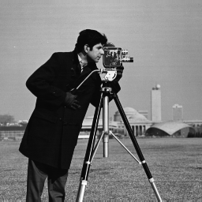
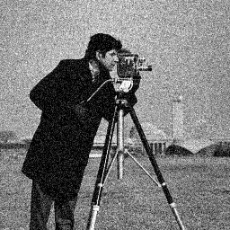
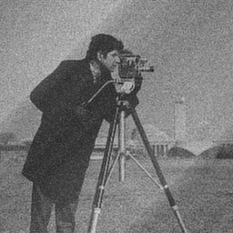
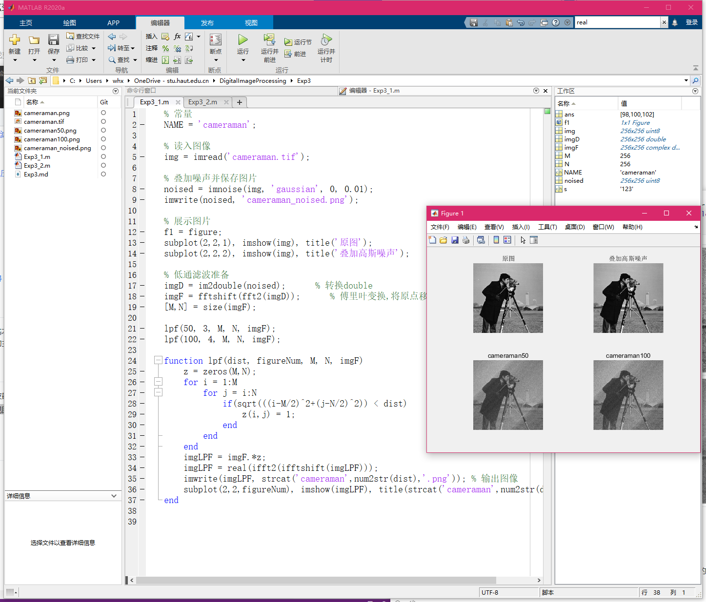

<h2 align='center'>实验三：频域处理实验</h2>

### 1. 实验目的

掌握在 MATLAB 下图像的平滑和降噪处理，利用离散余弦变换实现图像压缩。

### 2. 实验内容

1. 实现利用理想低通滤波器对图像进行平滑和去噪处理，观察不同半径范围对结果的影响；

2. 利用离散余弦变换实现图像压缩的效果：如只保留频谱矩阵的左上角区域，然后恢复图像观察对结果的影响。

### 3. 实验过程及结果

#### 低通滤波

滤掉高频部分，仅允许低频通过，以去掉噪声，使图像得到平滑。

具体步骤可分为：

1. 将图像进行傅里叶变换，将低频移至中心
2. 在频域进行处理，首先，计算理想低通滤波器，然后将其与傅里叶频谱相乘。
3. 傅里叶反变换回空间域

多次实验可以观察到，当半径越低，能通过的频率分量越少，图像越模糊，并伴有振铃现象；当截止频率越高，能滤过的频率分量越多，图像就越清晰。

代码实现如下：

```matlab
% 常量
NAME = 'cameraman';

% 读入图像
img = imread('cameraman.tif');

% 叠加噪声并保存图片
noised = imnoise(img, 'gaussian', 0, 0.01);
imwrite(noised, 'cameraman_noised.png');

% 展示图片
f1 = figure;
subplot(2,2,1), imshow(img), title('原图');
subplot(2,2,2), imshow(img), title('叠加高斯噪声');

% 低通滤波准备
imgD = im2double(noised);      % 转换double
imgF = fftshift(fft2(imgD));   % 傅里叶变换,将原点移至矩形中心 
[M,N] = size(imgF);

lpf(50, 3, M, N, imgF);
lpf(100, 4, M, N, imgF);

% 低通滤波函数
function lpf(dist, figureNum, M, N, imgF)
    z = zeros(M,N);
    for i = 1:M 
        for j = i:N 
            if(sqrt(((i-M/2)^2+(j-N/2)^2)) < dist) 
                z(i,j) = 1; 
            end 
        end 
    end
    imgLPF = imgF.*z;
    imgLPF = real(ifft2(ifftshift(imgLPF)));
     % 展示并输出图像
    imwrite(imgLPF, strcat('cameraman',num2str(dist),'.png'));
    subplot(2,2,figureNum), imshow(imgLPF), title(strcat('cameraman',num2str(dist)));
end
```

|                      |         |
| -------------------------------------------- | ---------------------------------------------- |
|  |  |

运行结果如下图所示：



### 离散余弦变换实现图像压缩

离散余弦变换常用于对信号和图像进行有损压缩，是很多常见的图像编码标准的基本组成模块。

具体步骤可大致分为：

1. 图像分块，并对每个子块进行二维离散余弦变换。
2. 产生DCT变换矩阵
3. 使用 `blkproc()` 函数对图像进行分块处理
4. 掩模，丢弃8*8矩阵的大部分系数，仅保留左上的10个
5. 使用每个数据块的二维逆 DCT 重构图像

代码实现如下：

```matlab
% 常量
NAME = 'cameraman';

% 读入图像并转换
img = imread('cameraman.tif');
img = im2double(img);

% 掩模
mask = [1   1   1   1   0   0   0   0
        1   1   1   0   0   0   0   0
        1   1   0   0   0   0   0   0
        1   0   0   0   0   0   0   0
        0   0   0   0   0   0   0   0
        0   0   0   0   0   0   0   0
        0   0   0   0   0   0   0   0
        0   0   0   0   0   0   0   0];

% 离散余弦变换
T = dctmtx(8);
dct = @(block_struct) T * block_struct.data * T';
B = blockproc(img,[8 8],dct);

% 丢弃8*8矩阵的大部分系数，仅保留左上的10个
B2 = blockproc(B,[8 8],@(block_struct) mask .* block_struct.data);

% 使用每个数据块的二维逆 DCT 重构图像
invdct = @(block_struct) T' * block_struct.data * T;
img_compressed = blockproc(B2,[8 8],invdct);

% 保存、展示图像
imwrite(img_compressed,strcat(NAME,'_compressed.png'));

figure;
subplot(1,2,1),imshow(img),title('原图');
subplot(1,2,2),imshow(img),title('压缩');
```

| 原图                     | 压缩后                                |
| ------------------------ | ------------------------------------- |
|  |  |

虽然在 MATLAB 图窗观察的并不明显，但在其它图片查看器中还是能显著观察到图片质量有所下降。

### 4. 实验中的问题及心得

理想低通滤波部分，对所学知识做了抽象和封装，运用函数简化了低通滤波部分的处理。通过对半径（截止频率）参数的修改，更直接地观察到了其对图像清晰程度的影响。离散余弦变换部分，压缩后的图像使我对平时见到的模糊、边缘锯齿的图片、视频及它们背后的压缩算法有了更深的认识和体会。

实验中编写低通滤波函数的过程中，碰到了若干语法上的问题，不过通过对比文档和资料中的实例，很快便得到了解决。