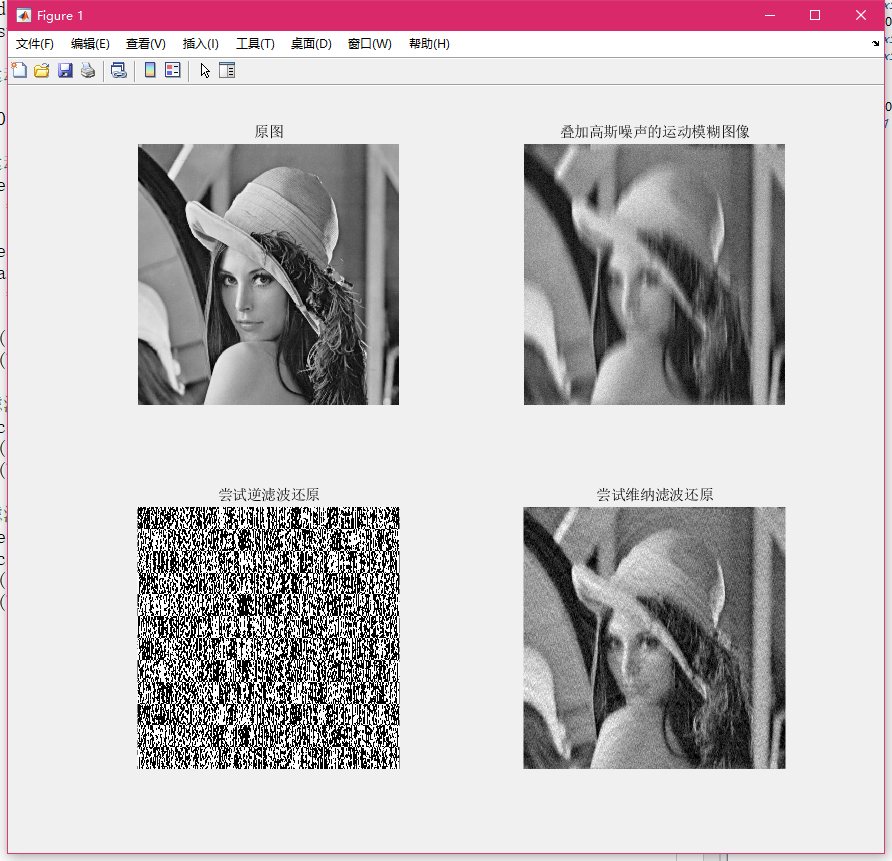

<h3 align='center'>实验四：图像复原</h3>

#### 一、实验目的

了解图像复原的基本原理，运用 MATLAB，体会基本的图像复原过程。

#### 二、实验内容

自行设置点扩展函数实现对降质图像的复原，采用维纳滤波复原和逆滤波复原两种方法并比较结果。

#### 三、实验过程及结果

实验代码及注释如下：

```matlab
% 读入lena图，并转换为双精度浮点类型
I = im2double(imread('Lena.png'));
figure,subplot(2,2,1),imshow(I),title("原图");

% 设置运动模糊位移、角度
len=30;
theta=90;

% 生成运动算子、卷积滤波，并展示图像
PSF=fspecial('motion',len,theta);
blurred = imfilter(I,PSF,'conv','circular');

noise_mean = 0;
noise_var = 0.001;
blurred = imnoise(blurred,'gaussian',noise_mean, noise_var);

subplot(2,2,2),imshow(blurred),title('叠加高斯噪声的运动模糊图像');
imwrite(blurred,'Blurred.png');

% 逆滤波还原
J1 = deconvwnr(blurred,PSF); % 维纳滤波函数deconvwnr没有参数NSPR时，为逆滤波
subplot(2,2,3),imshow(J1),title('尝试逆滤波还原');
imwrite(blurred,'Restoration_of_Blurred.png');

% 维纳滤波还原
estimated_nsr = noise_var / var(I(:));
J1 = deconvwnr(blurred,PSF,estimated_nsr);
subplot(2,2,4),imshow(J1),title('尝试维纳滤波还原');
imwrite(blurred,'Restoration_of_Blurred_Estimated.png');
```

本次实验使用了 MATLAB 提供的 `deconvwnr` 函数，该函数说明如下：

> `J = deconvwnr(I,psf)` 使用 Wiener 滤波算法对图像 `I` 进行反卷积，无估计噪声。在不含噪情况下，Wiener 滤波等效于理想的逆滤波。、
> 
> `J = deconvwnr(I,psf,nsr)` 使用 Wiener 滤波算法对图像 `I` 进行反卷积，从而返回去模糊后的图像 `J`。`psf` 是对 `I` 进行卷积的点扩散函数 (PSF)。`nsr` 是加性噪声的噪信功率比。在估计图像与真实图像之间的最小均方误差意义上，该算法是最优的。

实验结果如下图所示。



#### 四、实验中的问题及心得