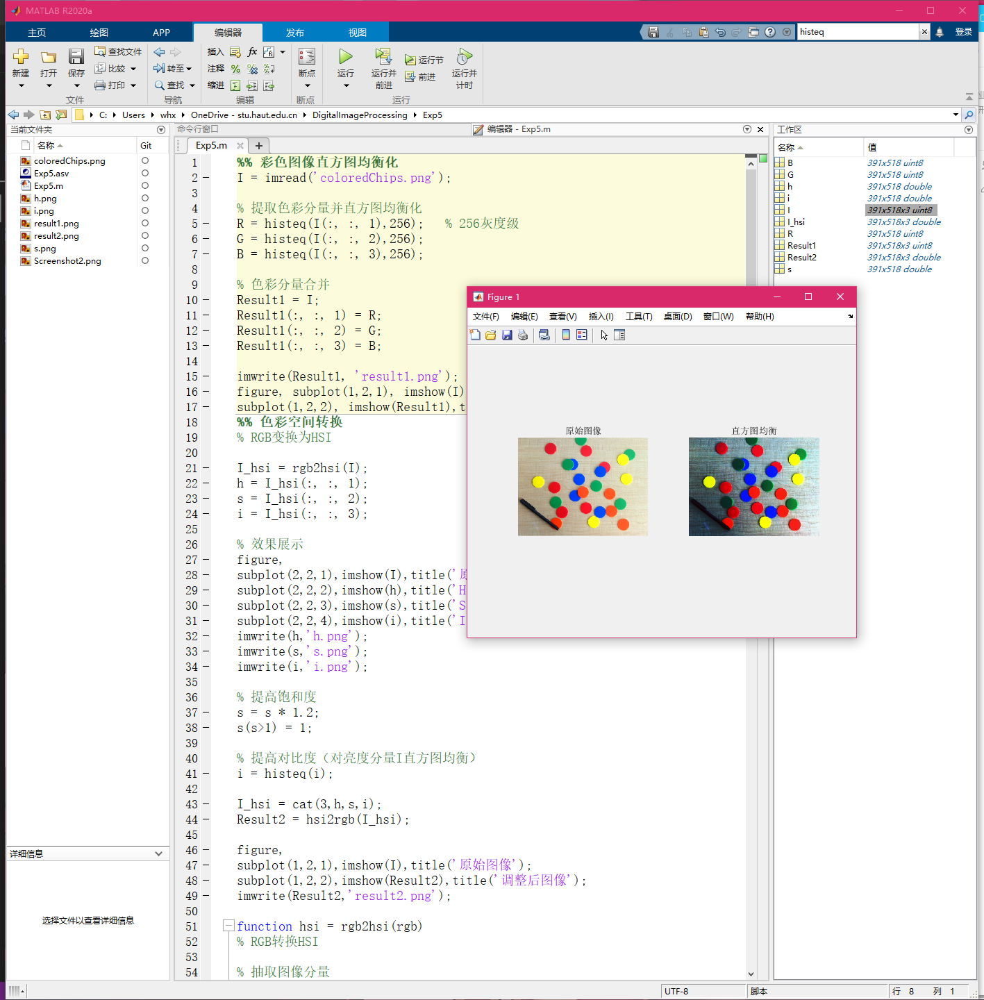
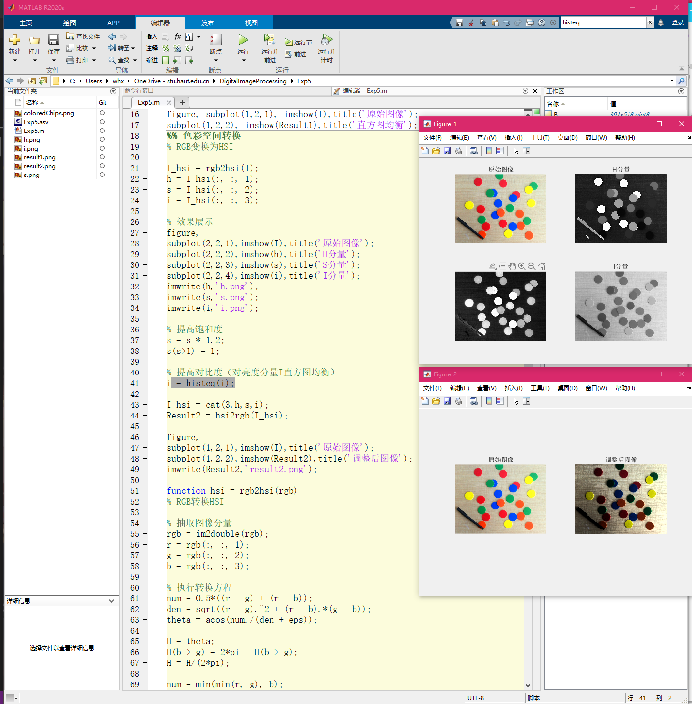

<h3 align='center'>实验五：彩色图像处理</h3>

#### 一、实验目的

了解色彩空间的有关知识，掌握直方图均衡化处理相关函数的用法。

#### 二、实验内容

1. 尝试对彩色图像进行直方图均衡化处理并分析为何处理后的图像色调会发生改变；
2. 通过色彩空间的转换在不改变色调的前提下提高彩色图像的饱和度和对比度。

#### 三、实验过程及结果

实验代码及注释如下：

```matlab
%% 彩色图像直方图均衡化
I = imread('coloredChips.png');

% 提取色彩分量并直方图均衡化
R = histeq(I(:, :, 1),256);   % 256灰度级
G = histeq(I(:, :, 2),256);
B = histeq(I(:, :, 3),256);

% 色彩分量合并
Result1 = I;
Result1(:, :, 1) = R;
Result1(:, :, 2) = G;
Result1(:, :, 3) = B;

imwrite(Result1, 'result1.png');
figure, subplot(1,2,1), imshow(I),title('原始图像');
subplot(1,2,2), imshow(Result1),title('直方图均衡');
%% 色彩空间转换
% RGB变换为HSI

I_hsi = rgb2hsi(I);
h = I_hsi(:, :, 1);
s = I_hsi(:, :, 2);
i = I_hsi(:, :, 3);

% 效果展示
figure, 
subplot(2,2,1),imshow(I),title('原始图像');
subplot(2,2,2),imshow(h),title('H分量');
subplot(2,2,3),imshow(s),title('S分量');
subplot(2,2,4),imshow(i),title('I分量');
imwrite(h,'h.png');
imwrite(s,'s.png');
imwrite(i,'i.png');

% 提高饱和度
s = s * 1.2;
s(s>1) = 1;

% 提高对比度（对亮度分量I直方图均衡）
i = histeq(i);

I_hsi = cat(3,h,s,i);
Result2 = hsi2rgb(I_hsi);

figure,
subplot(1,2,1),imshow(I),title('原始图像');
subplot(1,2,2),imshow(Result2),title('调整后图像');
imwrite(Result2,'result2.png');

function hsi = rgb2hsi(rgb)
% RGB转换HSI
 
% 抽取图像分量
rgb = im2double(rgb);
r = rgb(:, :, 1);
g = rgb(:, :, 2);
b = rgb(:, :, 3);
 
% 执行转换方程
num = 0.5*((r - g) + (r - b));
den = sqrt((r - g).^2 + (r - b).*(g - b));
theta = acos(num./(den + eps));
 
H = theta;
H(b > g) = 2*pi - H(b > g);
H = H/(2*pi);
 
num = min(min(r, g), b);
den = r + g + b;
den(den == 0) = eps;
S = 1 - 3.* num./den;
 
H(S == 0) = 0;
 
I = (r + g + b)/3;
 
% 将3个分量联合成为一个HSI图像
hsi = cat(3, H, S, I);
end

function rgb = hsi2rgb(hsi)
hsi = double(hsi);
H = hsi(:,:,1);
S = hsi(:,:,2);
I = hsi(:,:,3);
R = zeros(size(H));
G = R;
B = R;
% 扩充弧度范围
H = H*2*pi;

index = find(0<=H & H<2*pi/3);
B(index) = I(index).*(1-S(index));
R(index) = I(index).*(1+(S(index).*cos(H(index)))./cos(pi/3-H(index)));
G(index) = 3*I(index)-(R(index)+B(index));

index = find(2*pi/3<=H & H<4*pi/3);
H(index) = H(index)-2*pi/3;
R(index) = I(index).*(1-S(index));
G(index) = I(index).*(1+(S(index).*cos(H(index)))./cos(pi/3-H(index)));
B(index) = 3*I(index)-(R(index)+G(index));

index = find(4*pi/3<=H & H<=2*pi);
H(index) = H(index)-4*pi/3;
G(index) = I(index).*(1-S(index));
B(index) = I(index).*(1+(S(index).*cos(H(index)))./cos(pi/3-H(index)));
R(index) = 3*I(index)-(B(index)+G(index));
% 合成色彩分量
rgb = cat(3,R,G,B);
end
```

实验结果如下图所示。





#### 四、实验中的问题及心得

经过本次实验，初步掌握了 MATLAB 色彩空间转换的基本方法，体会到 HSI 色彩模型对比 RGB 色彩模型的独特之处。最大的收获是掌握了利用 MATLAB 工具进行饱和度、对比度、亮度和色调调节的方法。