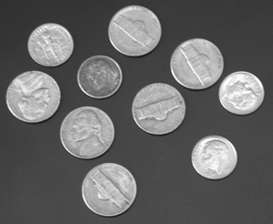

<h3 align='center'>实验六：图像分割与形态学处理</h3>

#### 一、实验目的

了解图像分割与形态学处理的有关知识，掌握 Otsu 算法、形态学相关函数的用法。

#### 二、实验内容

实现 Ostu 阈值分割算法的具体过程，对输入的一幅灰度图像进行阈值分割，并利用形态学处理的方法对分割结果进行优化。

#### 三、实验过程及结果

实验代码及注释如下：

```matlab
%% 读入图片
I = imread('coins.png');
%I = im2double(I);

%% Otsu算法二值图像分割
K = graythresh(I);      % 使用 Otsu 方法计算全局图像阈值
I_otsu = im2bw(I,K);    % 转换为二值图像
figure, subplot(1,3,1),imshow(I),title('原图');
subplot(1,3,2),imshow(I_otsu),title('otsu算法分割后');
imwrite(I_otsu,'coins_otsu.png');

%% 形态学处理 - 膨胀
SE = strel('square',5);             % 生成方形算子
I_expand = imdilate(I_otsu, SE);    % 膨胀
subplot(1,3,3),imshow(I_expand),title('膨胀');
imwrite(I_expand,'coins_expand.png');
```

实验结果如下图所示。




#### 四、实验中的问题及心得

经过本次使用，我对使用 MATLAB 对图像进行二值分割的方法有了一定的了解，会简单运用 MATLAB 内置函数进行基本的形态学运算，对图像分割和形态学处理的知识有了更深的体会。

